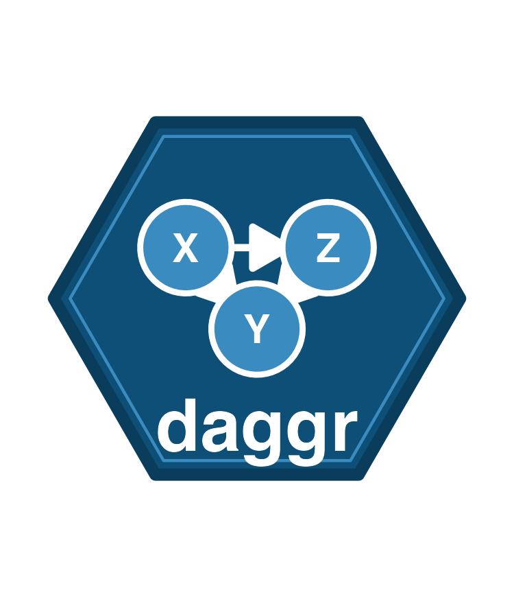

<!-- README.md is generated from README.Rmd. Please edit that file -->

```{r, include = FALSE}
knitr::opts_chunk$set(
  collapse = TRUE,
  comment = "#>",
  fig.path = "man/figures/README-",
  out.width = "60%",
  dpi = 300
)
```

# daggr 

<!-- badges: start -->
[](https://lifecycle.r-lib.org/articles/stages.html#experimental)
<!-- badges: end -->

**daggr** wraps [ggdiagram](https://github.com/wjschne/ggdiagram) and [ggarrow](https://github.com/teunbrand/ggarrow) with opinionated defaults so you can draw clean DAGs in 3 lines instead of 30.

## Installation

```r
# install.packages("pak")
pak::pak("benjaminguinaudeau/daggr")
```

## Example

```r
library(daggr)

# Create nodes
x <- dag_ellipse("X", a = 1.2, b = 0.7)
z <- dag_ellipse("Z", a = 1.2, b = 0.7) |> place(from = x, where = "right", sep = 4)
y <- dag_ellipse("Y", a = 1.2, b = 0.7) |> place(from = x, where = "southeast", sep = 3)

# Draw the DAG
ggdiagram() +
  x + z + y +
  dag_connect(x, z) +
  dag_connect(x, y) +
  dag_connect(z, y) +
  theme_dag()
```


## Learn more

- [Getting started](https://benjaminguinaudeau.github.io/daggr/articles/daggr.html) — canonical DAG structures and basic features
- [DAG Gallery](https://benjaminguinaudeau.github.io/daggr/articles/gallery.html) — complex real-world examples
- [Function reference](https://benjaminguinaudeau.github.io/daggr/reference/)
