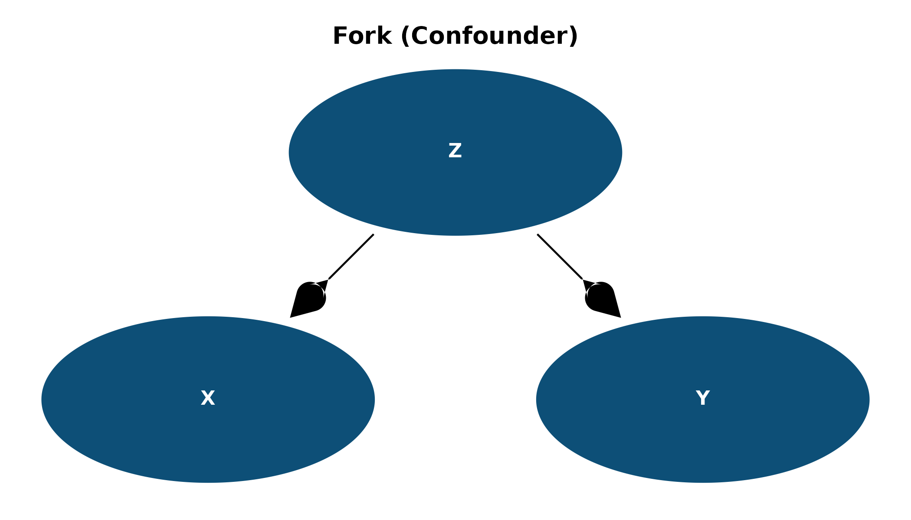
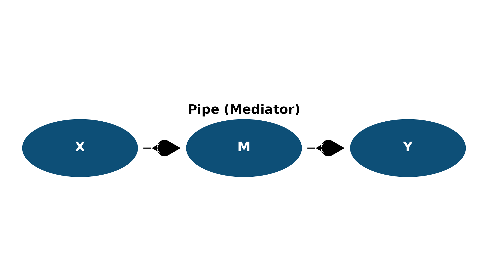
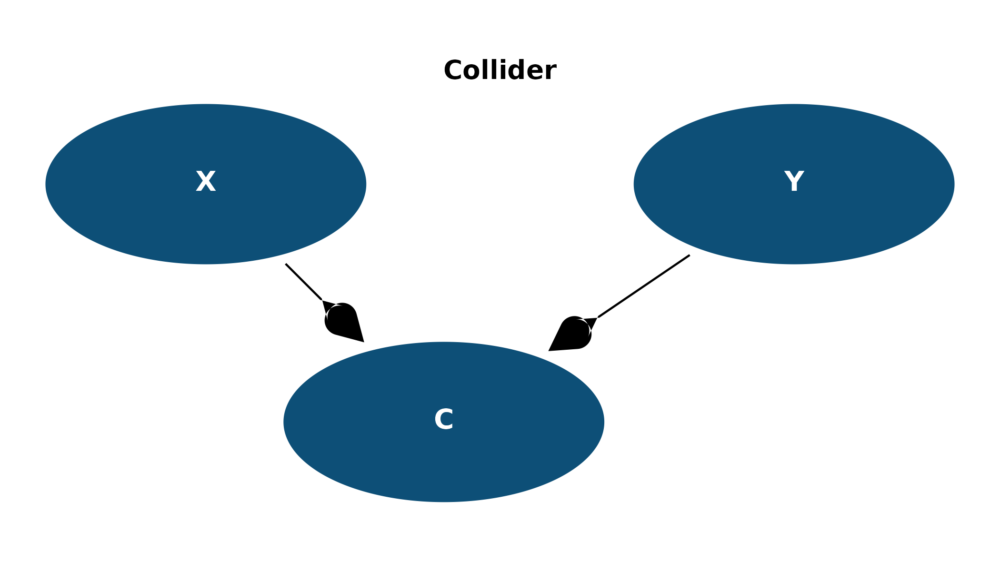
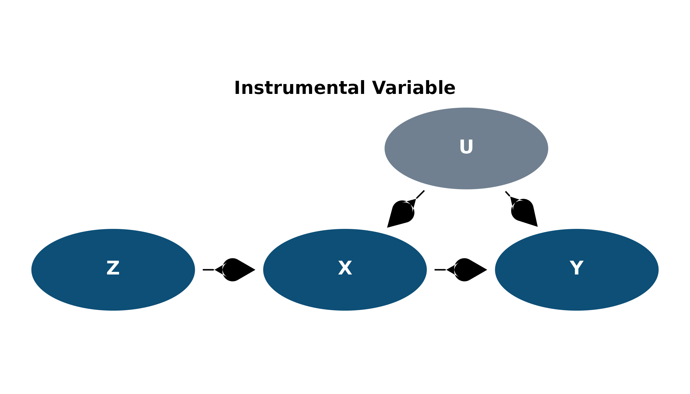
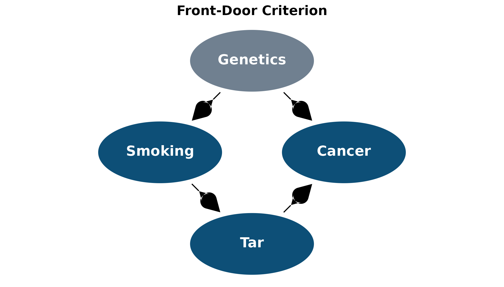
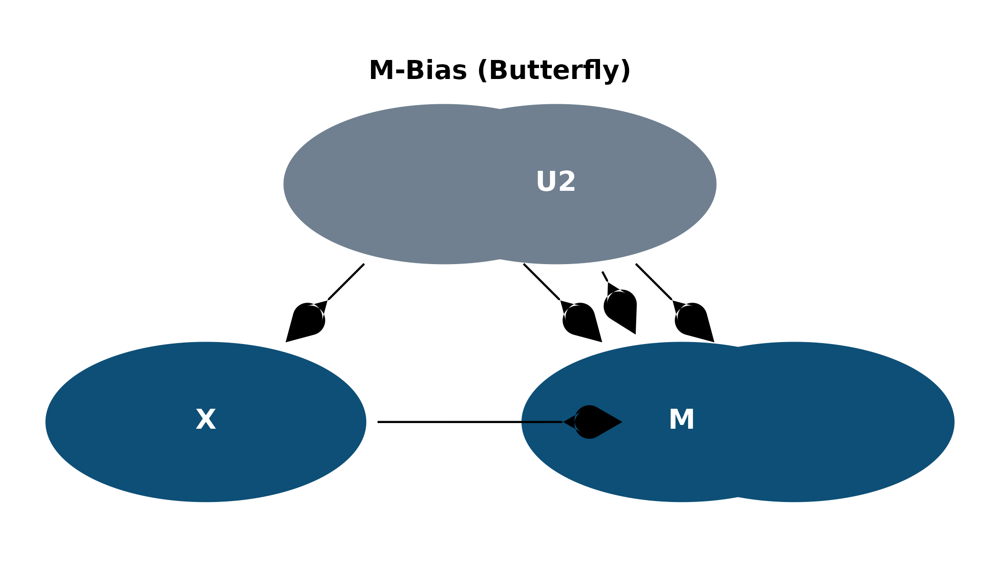
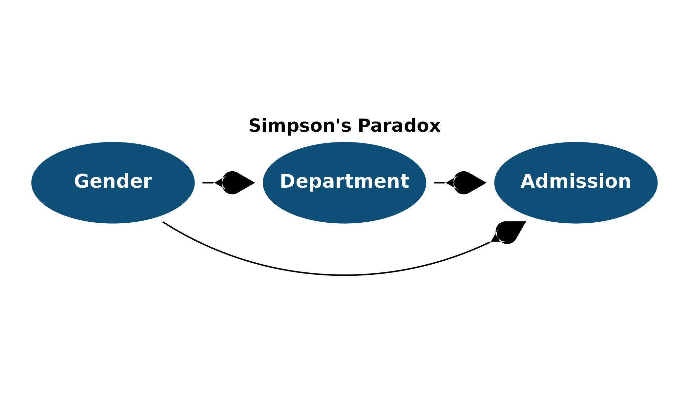

# Getting Started with daggr

## Why daggr?

Drawing DAGs with `ggdiagram` and `ggarrow` is powerful but requires ~30
lines of boilerplate (helper functions, arrowhead config, theme setup).
`daggr` wraps all of that so you can focus on the graph itself.

## 1. Fork (Confounder)

A common cause **Z** creates a spurious association between **X** and
**Y**. Conditioning on **Z** blocks the backdoor path.

``` r
Z <- dag_ellipse("Z")
X <- dag_ellipse("X") |> place(from = Z, where = "below left", sep = 2.5)
Y <- dag_ellipse("Y") |> place(from = Z, where = "below right", sep = 2.5)

ggdiagram(font_size = 14) +
  Z + X + Y +
  dag_connect(Z, X) +
  dag_connect(Z, Y) +
  theme_dag() +
  ggplot2::labs(title = "Fork (Confounder)")
```



Fork (Confounder)

## 2. Pipe (Mediator)

The effect of **X** on **Y** is transmitted entirely through the
mediator **M**. Conditioning on **M** blocks the causal path.

``` r
X <- dag_ellipse("X")
M <- dag_ellipse("M") |> place(from = X, where = "right", sep = 2.5)
Y <- dag_ellipse("Y") |> place(from = M, where = "right", sep = 2.5)

ggdiagram(font_size = 14) +
  X + M + Y +
  dag_connect(X, M) +
  dag_connect(M, Y) +
  theme_dag() +
  ggplot2::labs(title = "Pipe (Mediator)")
```



Pipe (Mediator)

## 3. Collider

**X** and **Y** are independent causes of **C**. Conditioning on the
collider **C** opens a spurious path between **X** and **Y**.

``` r
X <- dag_ellipse("X")
Y <- dag_ellipse("Y") |> place(from = X, where = "right", sep = 5)
C <- dag_ellipse("C") |> place(from = X, where = "below right", sep = 2.5)

ggdiagram(font_size = 14) +
  X + Y + C +
  dag_connect(X, C) +
  dag_connect(Y, C) +
  theme_dag() +
  ggplot2::labs(title = "Collider")
```



Collider

## 4. Instrumental Variable

**Z** is an instrument: it affects **Y** only through **X**. The
unmeasured confounder **U** biases the naive **X -\> Y** estimate, but
the instrument identifies the causal effect.

``` r
Z <- dag_ellipse("Z")
X <- dag_ellipse("X") |> place(from = Z, where = "right", sep = 2.5)
Y <- dag_ellipse("Y") |> place(from = X, where = "right", sep = 2.5)
U <- dag_ellipse("U", fill = "#708090") |>
  place(from = X, where = "above right", sep = 2.5)

ggdiagram(font_size = 14) +
  Z + X + Y + U +
  dag_connect(Z, X) +
  dag_connect(X, Y) +
  dag_connect(U, X) +
  dag_connect(U, Y) +
  theme_dag() +
  ggplot2::labs(title = "Instrumental Variable")
```



Instrumental Variable

## 5. Front-Door (Smoking-Tar-Cancer)

Pearl’s canonical example. Unmeasured **Genetics** confounds **Smoking**
and **Cancer**, but the front-door path through **Tar** allows
identification.

``` r
Genetics <- dag_ellipse("Genetics", fill = "#708090")
Smoking  <- dag_ellipse("Smoking") |>
  place(from = Genetics, where = "below left", sep = 2.5)
Cancer   <- dag_ellipse("Cancer") |>
  place(from = Genetics, where = "below right", sep = 2.5)
Tar      <- dag_ellipse("Tar") |>
  place(from = Smoking, where = "below right", sep = 2.5)

ggdiagram(font_size = 14) +
  Genetics + Smoking + Cancer + Tar +
  dag_connect(Genetics, Smoking) +
  dag_connect(Genetics, Cancer) +
  dag_connect(Smoking, Tar) +
  dag_connect(Tar, Cancer) +
  theme_dag() +
  ggplot2::labs(title = "Front-Door Criterion")
```



Front-Door Criterion

## 6. M-Bias (Butterfly)

Adjusting for the collider **M** *increases* bias. **U1** and **U2** are
unmeasured, but conditioning on **M** opens a spurious path between
**X** and **Y**.

``` r
X  <- dag_ellipse("X")
Y  <- dag_ellipse("Y")  |> place(from = X, where = "right", sep = 5)
U1 <- dag_ellipse("U1", fill = "#708090") |>
  place(from = X, where = "above right", sep = 2.5)
U2 <- dag_ellipse("U2", fill = "#708090") |>
  place(from = Y, where = "above left", sep = 2.5)
M  <- dag_ellipse("M") |>
  place(from = U1, where = "below right", sep = 2.5)

ggdiagram(font_size = 14) +
  X + Y + U1 + U2 + M +
  dag_connect(U1, X) +
  dag_connect(U1, M) +
  dag_connect(U2, M) +
  dag_connect(U2, Y) +
  dag_connect(X, Y) +
  theme_dag() +
  ggplot2::labs(title = "M-Bias (Butterfly)")
```



M-Bias (Butterfly)

## 7. Simpson’s Paradox (Berkeley Admissions)

**Gender** affects both **Department** choice and **Admission**
directly. The marginal association reverses when conditioning on
**Department**.

``` r
Gender     <- dag_ellipse("Gender")
Department <- dag_ellipse("Department") |>
  place(from = Gender, where = "right", sep = 2.5)
Admission  <- dag_ellipse("Admission") |>
  place(from = Department, where = "right", sep = 2.5)

ggdiagram(font_size = 14) +
  Gender + Department + Admission +
  dag_connect(Gender, Department) +
  dag_connect(Department, Admission) +
  dag_connect(Gender, Admission, arc_bend = 0.4) +
  theme_dag() +
  ggplot2::labs(title = "Simpson's Paradox")
```



Simpson’s Paradox
