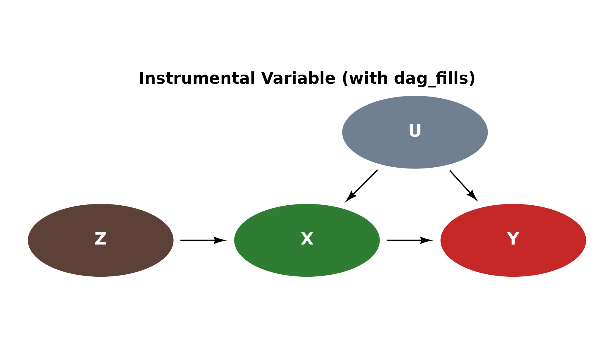
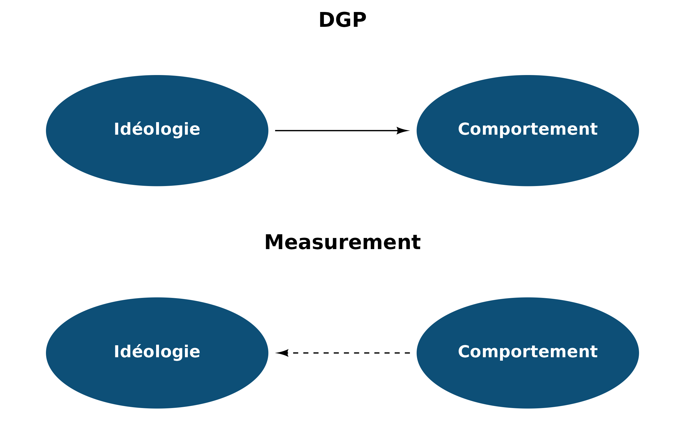
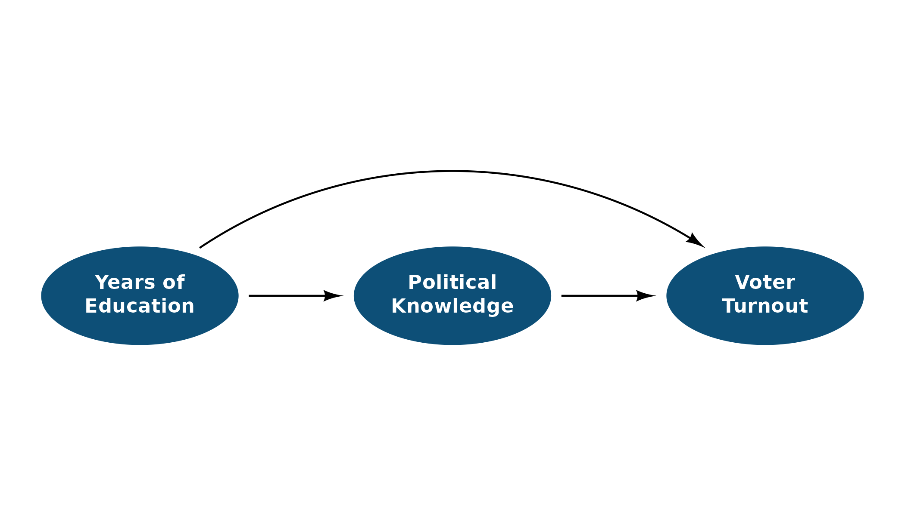
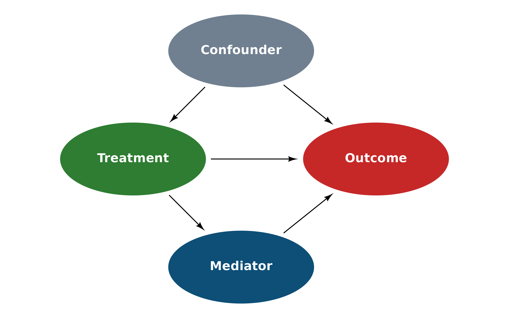

# Getting Started with daggr

## Why daggr?

Drawing DAGs with `ggdiagram` and `ggarrow` is powerful but requires ~30
lines of boilerplate (helper functions, arrowhead config, theme setup).
`daggr` wraps all of that so you can focus on the graph itself.

## Canonical DAG Structures

### 1. Fork (Confounder)

A common cause **Z** creates a spurious association between **X** and
**Y**. Conditioning on **Z** blocks the backdoor path.

``` r
Z <- dag_ellipse("Z")
X <- dag_ellipse("X") |> place(from = Z, where = "below left", sep = 2.5)
Y <- dag_ellipse("Y") |> place(from = Z, where = "below right", sep = 2.5)

ggdiagram(font_size = 14) +
  Z + X + Y +
  dag_connect(Z, X) +
  dag_connect(Z, Y) +
  theme_dag() +
  ggplot2::labs(title = "Fork (Confounder)")
```


Fork (Confounder)

### 2. Pipe (Mediator)

The effect of **X** on **Y** is transmitted entirely through the
mediator **M**. Conditioning on **M** blocks the causal path.

``` r
X <- dag_ellipse("X")
M <- dag_ellipse("M") |> place(from = X, where = "right", sep = 2.5)
Y <- dag_ellipse("Y") |> place(from = M, where = "right", sep = 2.5)

ggdiagram(font_size = 14) +
  X + M + Y +
  dag_connect(X, M) +
  dag_connect(M, Y) +
  theme_dag() +
  ggplot2::labs(title = "Pipe (Mediator)")
```


Pipe (Mediator)

### 3. Collider

**X** and **Y** are independent causes of **C**. Conditioning on the
collider **C** opens a spurious path between **X** and **Y**.

``` r
X <- dag_ellipse("X")
Y <- dag_ellipse("Y") |> place(from = X, where = "right", sep = 5)
C <- dag_ellipse("C") |> place(from = X, where = "below right", sep = 2.5)

ggdiagram(font_size = 14) +
  X + Y + C +
  dag_connect(X, C) +
  dag_connect(Y, C) +
  theme_dag() +
  ggplot2::labs(title = "Collider")
```


Collider

### 4. Instrumental Variable

**Z** is an instrument: it affects **Y** only through **X**. The
unmeasured confounder **U** biases the naive **X -\> Y** estimate, but
the instrument identifies the causal effect.

``` r
Z <- dag_ellipse("Z")
X <- dag_ellipse("X") |> place(from = Z, where = "right", sep = 2.5)
Y <- dag_ellipse("Y") |> place(from = X, where = "right", sep = 2.5)
U <- dag_ellipse("U", fill = "#708090") |>
  place(from = X, where = "above right", sep = 2.5)

ggdiagram(font_size = 14) +
  Z + X + Y + U +
  dag_connect(Z, X) +
  dag_connect(X, Y) +
  dag_connect(U, X) +
  dag_connect(U, Y) +
  theme_dag() +
  ggplot2::labs(title = "Instrumental Variable")
```


Instrumental Variable

### 5. Front-Door (Smoking-Tar-Cancer)

Pearl’s canonical example. Unmeasured **Genetics** confounds **Smoking**
and **Cancer**, but the front-door path through **Tar** allows
identification.

``` r
Genetics <- dag_ellipse("Genetics", fill = "#708090")
Smoking  <- dag_ellipse("Smoking") |>
  place(from = Genetics, where = "below left", sep = 2.5)
Cancer   <- dag_ellipse("Cancer") |>
  place(from = Genetics, where = "below right", sep = 2.5)
Tar      <- dag_ellipse("Tar") |>
  place(from = Smoking, where = "below right", sep = 2.5)

ggdiagram(font_size = 14) +
  Genetics + Smoking + Cancer + Tar +
  dag_connect(Genetics, Smoking) +
  dag_connect(Genetics, Cancer) +
  dag_connect(Smoking, Tar) +
  dag_connect(Tar, Cancer) +
  theme_dag() +
  ggplot2::labs(title = "Front-Door Criterion")
```


Front-Door Criterion

### 6. M-Bias (Butterfly)

Adjusting for the collider **M** *increases* bias. **U1** and **U2** are
unmeasured, but conditioning on **M** opens a spurious path between
**X** and **Y**.

``` r
X  <- dag_ellipse("X")
Y  <- dag_ellipse("Y")  |> place(from = X, where = "right", sep = 5)
U1 <- dag_ellipse("U1", fill = "#708090") |>
  place(from = X, where = "above right", sep = 2.5)
U2 <- dag_ellipse("U2", fill = "#708090") |>
  place(from = Y, where = "above left", sep = 2.5)
M  <- dag_ellipse("M") |>
  place(from = U1, where = "below right", sep = 2.5)

ggdiagram(font_size = 14) +
  X + Y + U1 + U2 + M +
  dag_connect(U1, X) +
  dag_connect(U1, M) +
  dag_connect(U2, M) +
  dag_connect(U2, Y) +
  dag_connect(X, Y) +
  theme_dag() +
  ggplot2::labs(title = "M-Bias (Butterfly)")
```


M-Bias (Butterfly)

### 7. Simpson’s Paradox (Berkeley Admissions)

**Gender** affects both **Department** choice and **Admission**
directly. The marginal association reverses when conditioning on
**Department**.

``` r
Gender     <- dag_ellipse("Gender")
Department <- dag_ellipse("Department") |>
  place(from = Gender, where = "right", sep = 2.5)
Admission  <- dag_ellipse("Admission") |>
  place(from = Department, where = "right", sep = 2.5)

ggdiagram(font_size = 14) +
  Gender + Department + Admission +
  dag_connect(Gender, Department) +
  dag_connect(Department, Admission) +
  dag_connect(Gender, Admission, arc_bend = 0.4) +
  theme_dag() +
  ggplot2::labs(title = "Simpson's Paradox")
```


Simpson’s Paradox

## Reducing Boilerplate

### Semantic Colors with `dag_fills`

Instead of repeating hex codes like `"#708090"` throughout your DAG, use
the built-in `dag_fills` palette. It provides autocomplete-friendly
names for common variable types:

``` r
dag_fills$treatment   # "#2E7D32" (green)
dag_fills$outcome     # "#C62828" (red)
dag_fills$unmeasured  # "#708090" (slate gray)
```

``` r
Z <- dag_ellipse("Z", fill = dag_fills$instrument)
X <- dag_ellipse("X", fill = dag_fills$treatment) |>
  place(from = Z, where = "right", sep = 2.5)
Y <- dag_ellipse("Y", fill = dag_fills$outcome) |>
  place(from = X, where = "right", sep = 2.5)
U <- dag_ellipse("U", fill = dag_fills$unmeasured) |>
  place(from = X, where = "above right", sep = 2.5)

ggdiagram(font_size = 14) +
  Z + X + Y + U +
  dag_connect(Z, X) +
  dag_connect(X, Y) +
  dag_connect(U, X) +
  dag_connect(U, Y) +
  theme_dag() +
  ggplot2::labs(title = "Instrumental Variable (with dag_fills)")
```



Using dag_fills

### Batch Edges with `dag_edges()`

For DAGs with many edges,
[`dag_edges()`](https://benjaminguinaudeau.github.io/daggr/reference/dag_edges.md)
lets you define all connections in one block instead of chaining
separate
[`dag_connect()`](https://benjaminguinaudeau.github.io/daggr/reference/dag_connect.md)
calls. Shared defaults (`resect`, `color`) are specified once; per-edge
overrides go inside each
[`dag_edge()`](https://benjaminguinaudeau.github.io/daggr/reference/dag_edge.md).

``` r
X  <- dag_ellipse("Treatment", fill = dag_fills$treatment)
M  <- dag_ellipse("Mediator") |> place(X, "right", sep = 4)
Y  <- dag_ellipse("Outcome", fill = dag_fills$outcome) |>
  place(M, "right", sep = 4)
C1 <- dag_ellipse("C1", fill = dag_fills$unmeasured) |>
  place(X, "above", sep = 2.5)
C2 <- dag_ellipse("C2", fill = dag_fills$unmeasured) |>
  place(M, "above", sep = 2.5)
U  <- dag_ellipse("U", fill = dag_fills$latent) |>
  place(Y, "above", sep = 2.5)

ggdiagram(font_size = 14) +
  X + M + Y + C1 + C2 + U +
  dag_edges(
    dag_edge(X, M),
    dag_edge(M, Y),
    dag_edge(X, Y, arc_bend = 0.4),
    dag_edge(C1, X),
    dag_edge(C1, M, arc_bend = -0.2),
    dag_edge(C2, M),
    dag_edge(C2, Y),
    dag_edge(U, M, linetype = "dashed"),
    dag_edge(U, Y, linetype = "dashed")
  ) +
  theme_dag()
```


Mediation DAG with dag_edges()

## Advanced Features

### DGP vs Measurement

Use `annotate()` to label layers, and `linetype` to distinguish causal
relationships from observed associations.

``` r
# DGP layer
dgp_ideo  <- dag_ellipse("Idéologie")
dgp_behav <- dag_ellipse("Comportement") |>
  place(dgp_ideo, "right", sep = 4)

# Measurement layer
meas_ideo  <- dag_ellipse("Idéologie") |>
  place(dgp_ideo, "bottom", sep = 3)
meas_behav <- dag_ellipse("Comportement") |>
  place(meas_ideo, "right", sep = 4)

ggdiagram(font_size = 14) +
  dgp_ideo + dgp_behav +
  meas_ideo + meas_behav +
  dag_connect(dgp_ideo, dgp_behav, linetype = "solid") +
  dag_connect(meas_behav, meas_ideo, linetype = "dashed") +
  ggplot2::annotate("text",
    x = mean(c(dgp_ideo@center@x, dgp_behav@center@x)),
    y = 3, label = "DGP", fontface = "bold", size = 6) +
  ggplot2::annotate("text",
    x = mean(c(meas_ideo@center@x, meas_behav@center@x)),
    y = -3, label = "Measurement", fontface = "bold", size = 6) +
  theme_dag()
```



DGP vs Measurement

### Mixed Node Shapes and Linetypes

Use
[`dag_rectangle()`](https://benjaminguinaudeau.github.io/daggr/reference/dag_rectangle.md)
for observed/constructed variables and different `linetype` values to
encode edge semantics (e.g., definitional links vs causal effects).

``` r
A <- dag_ellipse("Intérêt politique")
B <- dag_ellipse("Autoplacement<br>Gauche-Droite") |>
  place(A, "top left", sep = 3.5)
C <- dag_ellipse("A voté<br>à la dernière<br>élection") |>
  place(A, "top right", sep = 3.5)
D <- dag_rectangle("Extrémisme", fill = "darkred") |>
  place(B, "top", sep = 2.5)
E <- dag_rectangle("Participation<br>électorale", fill = "darkred") |>
  place(C, "top", sep = 2.5)

ggdiagram() +
  A + B + C + D + E +
  dag_connect(D, B, linetype = 4) +
  dag_connect(E, C, linetype = 4) +
  dag_connect(A, B) +
  dag_connect(A, C) +
  dag_connect(B, C) +
  dag_connect(D, E, linetype = 3) +
  theme_dag()
```


Political Attitudes DAG

### Multiline Labels

Node labels support `<br>` for line breaks, which is useful for longer
variable names.

``` r
X <- dag_ellipse("Years of<br>Education")
M <- dag_ellipse("Political<br>Knowledge") |>
  place(X, "right", sep = 3.5)
Y <- dag_ellipse("Voter<br>Turnout") |>
  place(M, "right", sep = 3.5)

ggdiagram(font_size = 14) +
  X + M + Y +
  dag_connect(X, M) +
  dag_connect(M, Y) +
  dag_connect(X, Y, arc_bend = -0.4) +
  theme_dag()
```



Multiline Labels

### Custom Colors

Change `fill` to distinguish different types of variables (e.g.,
treatment, outcome, unmeasured).

``` r
Treatment <- dag_ellipse("Treatment", fill = "#2E7D32")
Outcome   <- dag_ellipse("Outcome", fill = "#C62828") |>
  place(Treatment, "right", sep = 4)
Confounder <- dag_ellipse("Confounder", fill = "#708090") |>
  place(Treatment, "above right", sep = 2.5)
Mediator   <- dag_ellipse("Mediator") |>
  place(Treatment, "below right", sep = 2.5)

ggdiagram(font_size = 14) +
  Treatment + Outcome + Confounder + Mediator +
  dag_connect(Treatment, Outcome) +
  dag_connect(Treatment, Mediator) +
  dag_connect(Mediator, Outcome) +
  dag_connect(Confounder, Treatment) +
  dag_connect(Confounder, Outcome) +
  theme_dag()
```



Custom Node Colors
