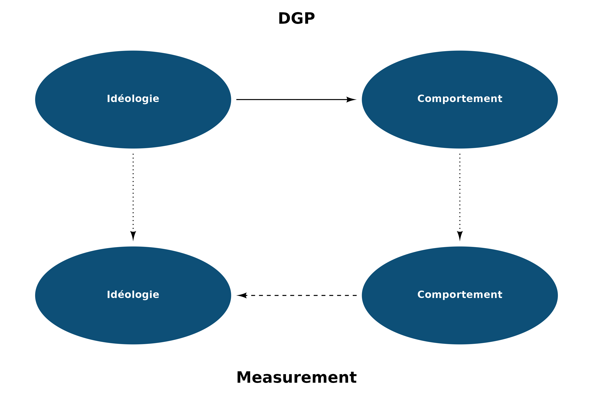
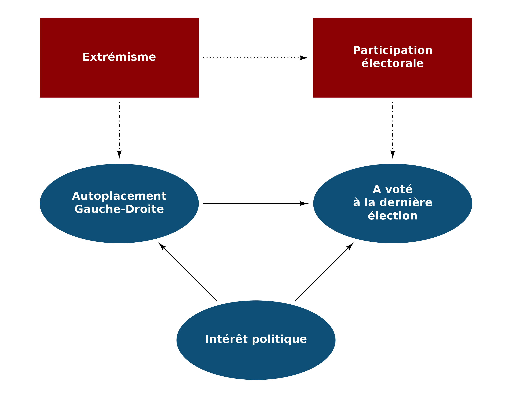
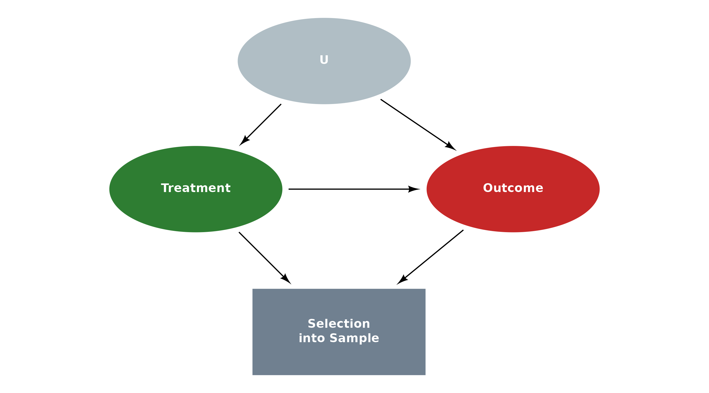
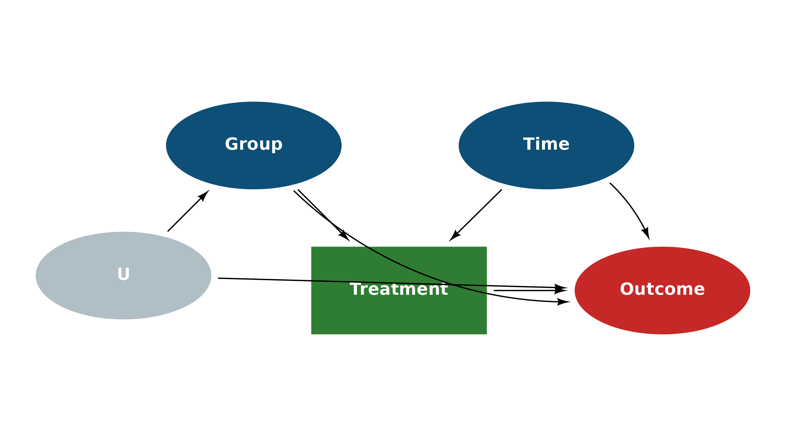
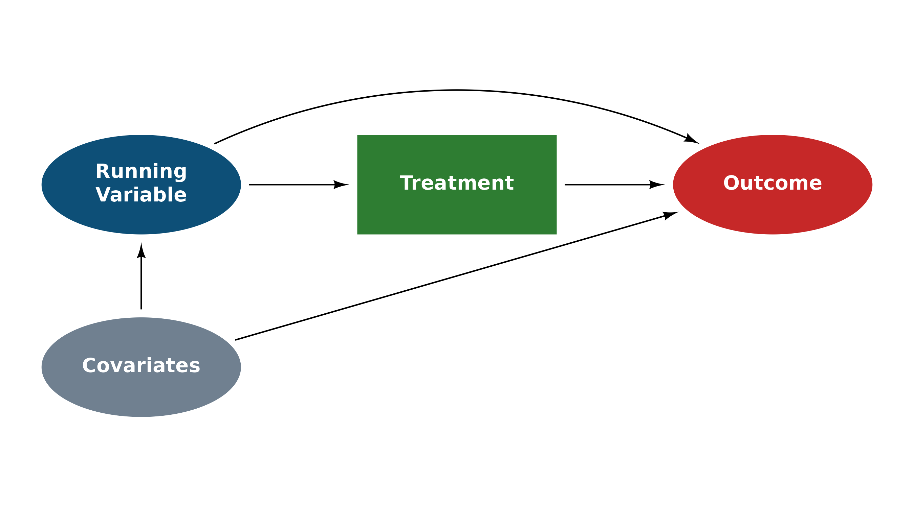
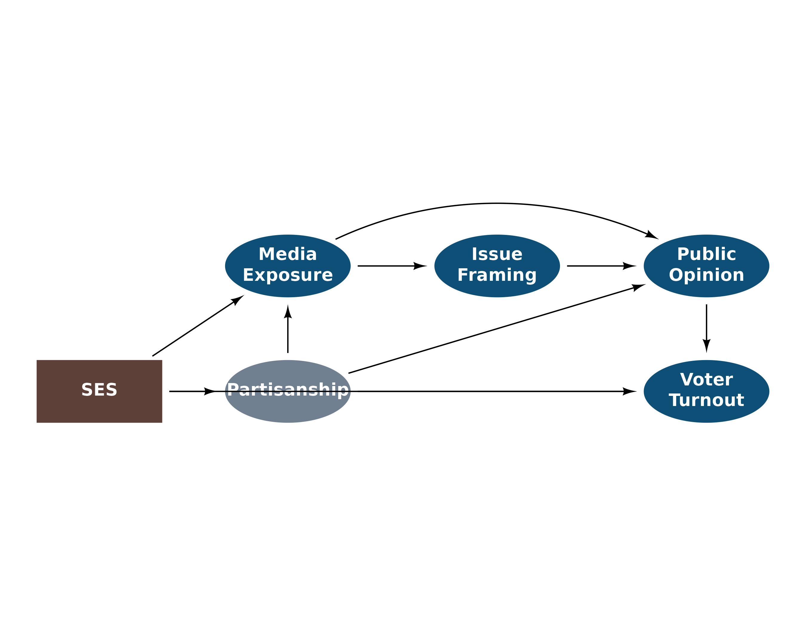
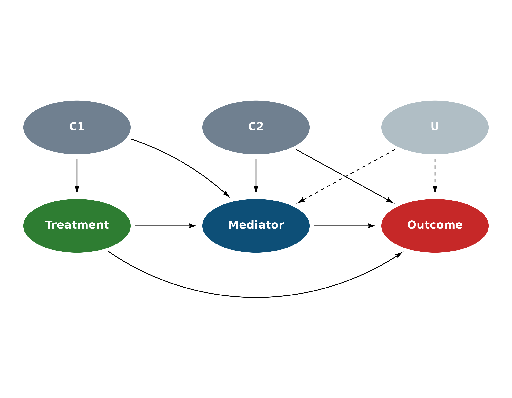
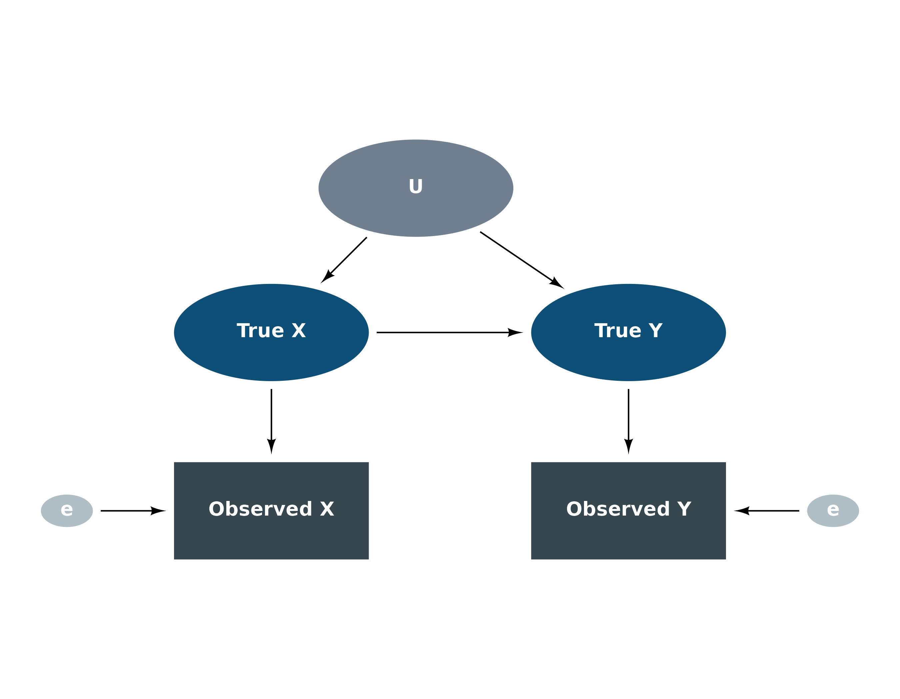
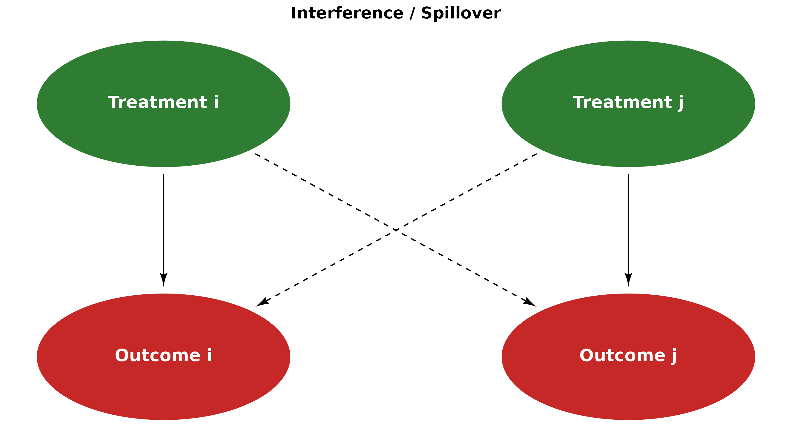

# DAG Gallery

A collection of realistic DAG examples showing the full range of `daggr`
features: mixed node shapes, linetypes, annotations, colors, curved
edges, and complex layouts.

## DGP vs Measurement

Two conceptual layers — the data-generating process (causal truth) and
what we actually observe. Solid arrows are causal; dashed arrows are
observed associations.

``` r
# DGP layer
dgp_ideo  <- dag_ellipse("Idéologie")
dgp_behav <- dag_ellipse("Comportement") |>
  place(dgp_ideo, "right", sep = 4)

# Measurement layer
meas_ideo  <- dag_ellipse("Idéologie") |>
  place(dgp_ideo, "bottom", sep = 3)
meas_behav <- dag_ellipse("Comportement") |>
  place(meas_ideo, "right", sep = 4)

ggdiagram(font_size = 14) +
  dgp_ideo + dgp_behav +
  meas_ideo + meas_behav +
  dag_connect(dgp_ideo, dgp_behav, linetype = "solid") +
  dag_connect(meas_behav, meas_ideo, linetype = "dashed") +
  dag_connect(dgp_ideo, meas_ideo, linetype = "dotted") +
  dag_connect(dgp_behav, meas_behav, linetype = "dotted") +
  ggplot2::annotate("text",
    x = mean(c(dgp_ideo@center@x, dgp_behav@center@x)),
    y = dgp_ideo@center@y + 2.5,
    label = "DGP", fontface = "bold", size = 6) +
  ggplot2::annotate("text",
    x = mean(c(meas_ideo@center@x, meas_behav@center@x)),
    y = meas_ideo@center@y - 2.5,
    label = "Measurement", fontface = "bold", size = 6) +
  theme_dag()
```



## Political Attitudes

A complex DAG mixing ellipses (latent variables) and rectangles
(constructed indicators), with different linetypes encoding the type of
relationship.

``` r
A <- dag_ellipse("Intérêt politique")
B <- dag_ellipse("Autoplacement<br>Gauche-Droite") |>
  place(A, "top left", sep = 3.5)
C <- dag_ellipse("A voté<br>à la dernière<br>élection") |>
  place(A, "top right", sep = 3.5)
D <- dag_rectangle("Extrémisme", fill = "darkred") |>
  place(B, "top", sep = 2.5)
E <- dag_rectangle("Participation<br>électorale", fill = "darkred") |>
  place(C, "top", sep = 2.5)

ggdiagram() +
  A + B + C + D + E +
  dag_connect(D, B, linetype = 4) +
  dag_connect(E, C, linetype = 4) +
  dag_connect(A, B) +
  dag_connect(A, C) +
  dag_connect(B, C) +
  dag_connect(D, E, linetype = 3) +
  theme_dag()
```



## Selection Bias

Conditioning on a post-treatment variable can induce selection bias.
Here, **S** (selection into the sample) is caused by both treatment and
outcome, creating a collider structure.

``` r
D <- dag_ellipse("Treatment", fill = "#2E7D32")
Y <- dag_ellipse("Outcome", fill = "#C62828") |>
  place(D, "right", sep = 5)
S <- dag_rectangle("Selection<br>into Sample", fill = "#708090") |>
  place(D, "below right", sep = 3)
U <- dag_ellipse("U", fill = "#B0BEC5") |>
  place(D, "above right", sep = 2.5)

ggdiagram(font_size = 14) +
  D + Y + S + U +
  dag_connect(D, Y) +
  dag_connect(D, S) +
  dag_connect(Y, S) +
  dag_connect(U, D) +
  dag_connect(U, Y) +
  theme_dag()
```



## Difference-in-Differences

The parallel trends assumption visualized. **Group** (treatment vs
control) and **Time** (pre vs post) jointly determine the outcome. The
unobserved counterfactual is what would have happened to the treated
group absent treatment.

``` r
Grp  <- dag_ellipse("Group")
Time <- dag_ellipse("Time") |> place(Grp, "right", sep = 4)
Tx   <- dag_rectangle("Treatment", fill = "#2E7D32") |>
  place(Grp, "below right", sep = 3)
Y    <- dag_ellipse("Outcome", fill = "#C62828") |>
  place(Tx, "right", sep = 3)
U    <- dag_ellipse("U", fill = "#B0BEC5") |>
  place(Grp, "below left", sep = 2.5)

ggdiagram(font_size = 14) +
  Grp + Time + Tx + Y + U +
  dag_connect(Grp, Tx) +
  dag_connect(Time, Tx) +
  dag_connect(Tx, Y) +
  dag_connect(Grp, Y, arc_bend = 0.3) +
  dag_connect(Time, Y, arc_bend = -0.3) +
  dag_connect(U, Grp) +
  dag_connect(U, Y) +
  theme_dag()
```



## Regression Discontinuity

The running variable determines treatment assignment via a threshold.
Potential confounders affect the outcome but cannot manipulate the
running variable precisely at the cutoff.

``` r
R  <- dag_ellipse("Running<br>Variable")
Tx <- dag_rectangle("Treatment", fill = "#2E7D32") |>
  place(R, "right", sep = 3.5)
Y  <- dag_ellipse("Outcome", fill = "#C62828") |>
  place(Tx, "right", sep = 3.5)
X  <- dag_ellipse("Covariates", fill = "#708090") |>
  place(R, "below", sep = 2.5)

ggdiagram(font_size = 14) +
  R + Tx + Y + X +
  dag_connect(R, Tx) +
  dag_connect(Tx, Y) +
  dag_connect(R, Y, arc_bend = -0.3) +
  dag_connect(X, R) +
  dag_connect(X, Y) +
  theme_dag()
```



## Media Effects

A multi-step model of media influence on political behavior, with both
direct and mediated pathways.

``` r
media    <- dag_ellipse("Media<br>Exposure")
framing  <- dag_ellipse("Issue<br>Framing") |>
  place(media, "right", sep = 4)
opinion  <- dag_ellipse("Public<br>Opinion") |>
  place(framing, "right", sep = 4)
turnout  <- dag_ellipse("Voter<br>Turnout") |>
  place(opinion, "below", sep = 3)
partisan <- dag_ellipse("Partisanship", fill = "#708090") |>
  place(media, "below", sep = 3)
ses      <- dag_rectangle("SES", fill = "#5D4037") |>
  place(partisan, "left", sep = 3)

ggdiagram(font_size = 14) +
  media + framing + opinion + turnout + partisan + ses +
  dag_connect(media, framing) +
  dag_connect(framing, opinion) +
  dag_connect(opinion, turnout) +
  dag_connect(media, opinion, arc_bend = -0.3) +
  dag_connect(partisan, media) +
  dag_connect(partisan, opinion) +
  dag_connect(partisan, turnout) +
  dag_connect(ses, media) +
  dag_connect(ses, partisan) +
  dag_connect(ses, turnout) +
  theme_dag()
```



## Mediation with Confounders

A complete mediation analysis DAG with treatment-induced and
exposure-induced confounders.

``` r
X <- dag_ellipse("Treatment", fill = "#2E7D32")
M <- dag_ellipse("Mediator") |> place(X, "right", sep = 4)
Y <- dag_ellipse("Outcome", fill = "#C62828") |> place(M, "right", sep = 4)
C1 <- dag_ellipse("C1", fill = "#708090") |>
  place(X, "above", sep = 2.5)
C2 <- dag_ellipse("C2", fill = "#708090") |>
  place(M, "above", sep = 2.5)
U  <- dag_ellipse("U", fill = "#B0BEC5") |>
  place(Y, "above", sep = 2.5)

ggdiagram(font_size = 14) +
  X + M + Y + C1 + C2 + U +
  dag_connect(X, M) +
  dag_connect(M, Y) +
  dag_connect(X, Y, arc_bend = 0.4) +
  dag_connect(C1, X) +
  dag_connect(C1, M, arc_bend = -0.2) +
  dag_connect(C2, M) +
  dag_connect(C2, Y) +
  dag_connect(U, M, linetype = "dashed") +
  dag_connect(U, Y, linetype = "dashed") +
  theme_dag()
```



## Measurement Error

When variables are measured with error, the observed indicators
(rectangles) are noisy reflections of the true latent constructs
(ellipses).

``` r
# Latent variables
X_true <- dag_ellipse("True X")
Y_true <- dag_ellipse("True Y") |> place(X_true, "right", sep = 5)
U      <- dag_ellipse("U", fill = "#708090") |>
  place(X_true, "above right", sep = 2.5)

# Observed indicators
X_obs <- dag_rectangle("Observed X", fill = "#37474F") |>
  place(X_true, "below", sep = 2.5)
Y_obs <- dag_rectangle("Observed Y", fill = "#37474F") |>
  place(Y_true, "below", sep = 2.5)

# Measurement errors
e_x <- dag_ellipse("e", fill = "#B0BEC5", a = 0.8, b = 0.5) |>
  place(X_obs, "left", sep = 2.5)
e_y <- dag_ellipse("e", fill = "#B0BEC5", a = 0.8, b = 0.5) |>
  place(Y_obs, "right", sep = 2.5)

ggdiagram(font_size = 14) +
  X_true + Y_true + U + X_obs + Y_obs + e_x + e_y +
  dag_connect(X_true, Y_true) +
  dag_connect(U, X_true) +
  dag_connect(U, Y_true) +
  dag_connect(X_true, X_obs) +
  dag_connect(Y_true, Y_obs) +
  dag_connect(e_x, X_obs) +
  dag_connect(e_y, Y_obs) +
  theme_dag()
```



## Interference / Spillover

In network or spatial settings, one unit’s treatment can affect another
unit’s outcome — a violation of SUTVA.

``` r
D_i <- dag_ellipse("Treatment i", fill = "#2E7D32")
D_j <- dag_ellipse("Treatment j", fill = "#2E7D32") |>
  place(D_i, "right", sep = 5)
Y_i <- dag_ellipse("Outcome i", fill = "#C62828") |>
  place(D_i, "below", sep = 3)
Y_j <- dag_ellipse("Outcome j", fill = "#C62828") |>
  place(D_j, "below", sep = 3)

ggdiagram(font_size = 14) +
  D_i + D_j + Y_i + Y_j +
  dag_connect(D_i, Y_i) +
  dag_connect(D_j, Y_j) +
  dag_connect(D_i, Y_j, linetype = "dashed") +
  dag_connect(D_j, Y_i, linetype = "dashed") +
  theme_dag() +
  ggplot2::labs(title = "Interference / Spillover")
```


