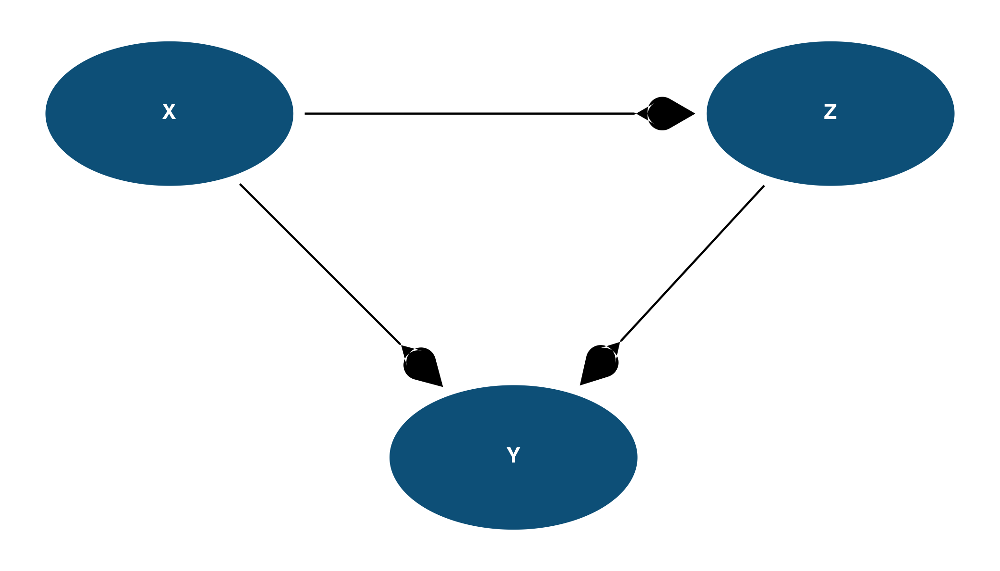

# daggr

**daggr** wraps [ggdiagram](https://github.com/wjschne/ggdiagram) and
[ggarrow](https://github.com/teunbrand/ggarrow) with opinionated
defaults so you can draw clean DAGs in 3 lines instead of 30.

## Installation

``` r
# install.packages("pak")
pak::pak("benjaminguinaudeau/daggr")
```

## Example

``` r
library(daggr)

# Create nodes
x <- dag_ellipse("X", a = 1.2, b = 0.7)
z <- dag_ellipse("Z", a = 1.2, b = 0.7) |> place(from = x, where = "right", sep = 4)
y <- dag_ellipse("Y", a = 1.2, b = 0.7) |> place(from = x, where = "southeast", sep = 3)

# Draw the DAG
ggdiagram() +
  x + z + y +
  dag_connect(x, z) +
  dag_connect(x, y) +
  dag_connect(z, y) +
  theme_dag()
```



## Learn more

- [Function
  reference](https://benjaminguinaudeau.github.io/daggr/reference/)
